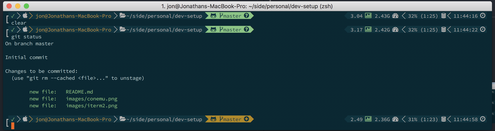
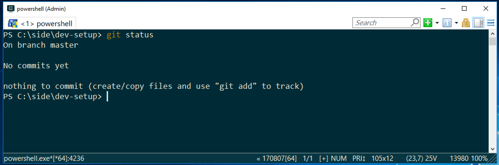

**[Terminal](#terminal)** | **[Editor](#editor)** 


# Development Environment Setup

This is a living corpus of my development environment setup

Quicklinks
- [Terminal](#terminal)
  - [Mac Terminal Settings](#mac)
  - [Windows Terminal Settings](#windows)
- [Editor](#editor)

## Terminal

**[Mac Terminal Settings](#mac)** | **[Windows Terminal Settings](#windows)**

### Mac

#### Package Manager


I use [Homebrew](https://brew.sh/) exclusively for managing software installs to my Mac. To install Homebrew run the following command in Terminal 

```bash
/usr/bin/ruby -e "$(curl -fsSL https://raw.githubusercontent.com/Homebrew/install/master/install)"
```

#### iTerm2

For Mac I use `iTerm2` with `powerlevel9k` installed.



Install iTerm2 with Homebrew:

```bash
brew cask install iterm2
```

Install iTerm2 manually:
https://www.iterm2.com/downloads.html


##### Zsh and Oh My Zsh
Next we want to install zsh and Oh My Zsh

https://sourabhbajaj.com/mac-setup/iTerm/zsh.html

##### powerlevel9k
To install the powerlevel9k theme

```bash
git clone https://github.com/bhilburn/powerlevel9k.git ~/.oh-my-zsh/custom/themes/powerlevel9k
```

##### Python
Make sure python and pip are installed by running the following
```bash
brew install python
sudo easy_install pip
```

##### .zshrc
Now that we have zsh and powerlevel9k installed we are ready to update our `.zshrc` file. Open your `.zshrc` file with the following command `code ~/.zshrc`

Replace everything under line 5 with the following in your `.zshrc` file

```bash

# Set name of the theme to load. Optionally, if you set this to "random"
# it'll load a random theme each time that oh-my-zsh is loaded.
# See https://github.com/robbyrussell/oh-my-zsh/wiki/Themes
ZSH_THEME="powerlevel9k/powerlevel9k"
POWERLEVEL9K_MODE='awesome-patched'
POWERLEVEL9K_PROMPT_ON_NEWLINE=true
POWERLEVEL9K_MULTILINE_FIRST_PROMPT_PREFIX="%\u250f"
POWERLEVEL9K_MULTILINE_SECOND_PROMPT_PREFIX="%\u2517% "
POWERLEVEL9K_SHORTEN_DIR_LENGTH=4
POWERLEVEL9K_SHORTEN_STRATEGY="truncate_middle"
POWERLEVEL9K_OS_ICON_BACKGROUND="black"
POWERLEVEL9K_OS_ICON_FOREGROUND="249"
POWERLEVEL9K_TODO_BACKGROUND="black"
POWERLEVEL9K_TODO_FOREGROUND="249"
POWERLEVEL9K_DIR_HOME_BACKGROUND="black"
POWERLEVEL9K_DIR_HOME_FOREGROUND="249"
POWERLEVEL9K_DIR_HOME_SUBFOLDER_BACKGROUND="black"
POWERLEVEL9K_DIR_HOME_SUBFOLDER_FOREGROUND="249"
POWERLEVEL9K_DIR_DEFAULT_BACKGROUND="black"
POWERLEVEL9K_DIR_DEFAULT_FOREGROUND="249"
POWERLEVEL9K_STATUS_OK_BACKGROUND="black"
POWERLEVEL9K_STATUS_OK_FOREGROUND="green"
POWERLEVEL9K_STATUS_ERROR_BACKGROUND="black"
POWERLEVEL9K_STATUS_ERROR_FOREGROUND="red"
POWERLEVEL9K_NVM_BACKGROUND="black"
POWERLEVEL9K_NVM_FOREGROUND="249"
POWERLEVEL9K_NVM_VISUAL_IDENTIFIER_COLOR="green"
POWERLEVEL9K_RVM_BACKGROUND="black"
POWERLEVEL9K_RVM_FOREGROUND="249"
POWERLEVEL9K_RVM_VISUAL_IDENTIFIER_COLOR="red"
POWERLEVEL9K_LOAD_CRITICAL_BACKGROUND="black"
POWERLEVEL9K_LOAD_WARNING_BACKGROUND="black"
POWERLEVEL9K_LOAD_NORMAL_BACKGROUND="black"
POWERLEVEL9K_LOAD_CRITICAL_FOREGROUND="249"
POWERLEVEL9K_LOAD_WARNING_FOREGROUND="249"
POWERLEVEL9K_LOAD_NORMAL_FOREGROUND="249"
POWERLEVEL9K_LOAD_CRITICAL_VISUAL_IDENTIFIER_COLOR="red"
POWERLEVEL9K_LOAD_WARNING_VISUAL_IDENTIFIER_COLOR="yellow"
POWERLEVEL9K_LOAD_NORMAL_VISUAL_IDENTIFIER_COLOR="green"
POWERLEVEL9K_RAM_BACKGROUND="black"
POWERLEVEL9K_RAM_FOREGROUND="249"
POWERLEVEL9K_RAM_ELEMENTS=(ram_free)
POWERLEVEL9K_BATTERY_LOW_BACKGROUND="black"
POWERLEVEL9K_BATTERY_CHARGING_BACKGROUND="black"
POWERLEVEL9K_BATTERY_CHARGED_BACKGROUND="black"
POWERLEVEL9K_BATTERY_DISCONNECTED_BACKGROUND="black"
POWERLEVEL9K_BATTERY_LOW_FOREGROUND="249"
POWERLEVEL9K_BATTERY_CHARGING_FOREGROUND="249"
POWERLEVEL9K_BATTERY_CHARGED_FOREGROUND="249"
POWERLEVEL9K_BATTERY_DISCONNECTED_FOREGROUND="249"
POWERLEVEL9K_BATTERY_LOW_VISUAL_IDENTIFIER_COLOR="red"
POWERLEVEL9K_BATTERY_CHARGING_VISUAL_IDENTIFIER_COLOR="yellow"
POWERLEVEL9K_BATTERY_CHARGED_VISUAL_IDENTIFIER_COLOR="green"
POWERLEVEL9K_BATTERY_DISCONNECTED_VISUAL_IDENTIFIER_COLOR="249"
POWERLEVEL9K_TIME_BACKGROUND="black"
POWERLEVEL9K_TIME_FOREGROUND="249"
POWERLEVEL9K_TIME_FORMAT="%D{%H:%M:%S} \UE12E"
POWERLEVEL9K_LEFT_PROMPT_ELEMENTS=('status' 'os_icon' 'todo' 'context' 'dir' 'vcs')
POWERLEVEL9K_RIGHT_PROMPT_ELEMENTS=('nvm' 'rvm' 'load' 'ram_joined' 'battery' 'time')

# Uncomment the following line to use case-sensitive completion.
# CASE_SENSITIVE="true"

# Uncomment the following line to use hyphen-insensitive completion. Case
# sensitive completion must be off. _ and - will be interchangeable.
# HYPHEN_INSENSITIVE="true"

# Uncomment the following line to disable bi-weekly auto-update checks.
# DISABLE_AUTO_UPDATE="true"

# Uncomment the following line to change how often to auto-update (in days).
# export UPDATE_ZSH_DAYS=13

# Uncomment the following line to disable colors in ls.
# DISABLE_LS_COLORS="true"

# Uncomment the following line to disable auto-setting terminal title.
# DISABLE_AUTO_TITLE="true"

# Uncomment the following line to enable command auto-correction.
# ENABLE_CORRECTION="true"

# Uncomment the following line to display red dots whilst waiting for completion.
# COMPLETION_WAITING_DOTS="true"

# Uncomment the following line if you want to disable marking untracked files
# under VCS as dirty. This makes repository status check for large repositories
# much, much faster.
# DISABLE_UNTRACKED_FILES_DIRTY="true"

# Uncomment the following line if you want to change the command execution time
# stamp shown in the history command output.
# The optional three formats: "mm/dd/yyyy"|"dd.mm.yyyy"|"yyyy-mm-dd"
# HIST_STAMPS="mm/dd/yyyy"

# Would you like to use another custom folder than $ZSH/custom?
# ZSH_CUSTOM=/path/to/new-custom-folder

# Which plugins would you like to load? (plugins can be found in ~/.oh-my-zsh/plugins/*)
# Custom plugins may be added to ~/.oh-my-zsh/custom/plugins/
# Example format: plugins=(rails git textmate ruby lighthouse)
# Add wisely, as too many plugins slow down shell startup.
plugins=(git)

source $ZSH/oh-my-zsh.sh

# User configuration

# export MANPATH="/usr/local/man:$MANPATH"

# You may need to manually set your language environment
# export LANG=en_US.UTF-8

# Preferred editor for local and remote sessions
# if [[ -n $SSH_CONNECTION ]]; then
#   export EDITOR='vim'
# else
#   export EDITOR='mvim'
# fi

# Compilation flags
# export ARCHFLAGS="-arch x86_64"

# ssh
# export SSH_KEY_PATH="~/.ssh/rsa_id"

# Set personal aliases, overriding those provided by oh-my-zsh libs,
# plugins, and themes. Aliases can be placed here, though oh-my-zsh
# users are encouraged to define aliases within the ZSH_CUSTOM folder.
# For a full list of active aliases, run `alias`.
#
# Example aliases
# alias zshconfig="mate ~/.zshrc"
# alias ohmyzsh="mate ~/.oh-my-zsh"
export PATH=~/Library/Python/2.7/bin/:$PATH
```

Next we need to add our powerline font as the default font for iTerm2. You can download the powerline font [here](assets/SourceCodePro+Powerline+Awesome+Regular.ttf)

This can be done by going to `Iterm2` -> `Preferences` -> `Profiles` -> `Text`


Restart iTerm2 and your changes should be reflected

You can find additional themes [here](https://github.com/bhilburn/powerlevel9k/wiki/Show-Off-Your-Config)

### Windows



#### Package Manager


I use [Chocolatey](https://chocolatey.org/) exclusively for managing software installs on my Windows machines. 

https://chocolatey.org/install


#### ConEmu

On Windows I use ConEmu as my terminal of choice. ConEmu has wide support

- cmd
- PowerShell
- Git Bash

ConEmu can be downloaded [here](https://conemu.github.io/)

## Editor

For development I use Visual Studio Code [VS Code]. You can download VC Code [here](https://code.visualstudio.com/download).

### VS Code Extensions
